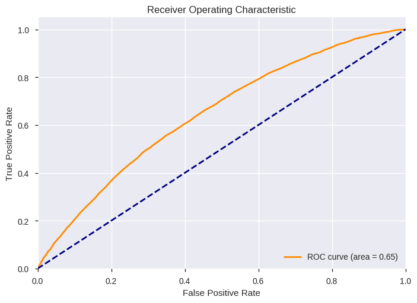

Introduction
============

Project Overview
----------------

Objective
~~~~~~~~~

Build a binary classification model that predicts the "Charged Off" or
"Fully Paid" Status of a loan, and explain what features are the best
predictors. The purpose is to use this model would be used to place
trades on loans immediately after they are issued by Lending Club.

Summary
~~~~~~~

Data used for this project comes directly from Lending Club’s historical
loan records (the full record contains more than 100 columns).

Project Setup
-------------

Import Libraries & Modules
~~~~~~~~~~~~~~~~~~~~~~~~~~

.. code:: ipython3

    from IPython.display import display
    from IPython.core.display import HTML
    from jupyterthemes import jtplot
    
    import warnings
    warnings.filterwarnings('ignore')
    
    import os
    if os.getcwd().split('/')[-1] == 'source':
        os.chdir('../../')

.. code:: ipython3

    import pandas as pd
    import numpy as np
    
    #import ipympl
    import matplotlib.pyplot as plt
    import matplotlib
    import seaborn as sns
    
    import pandas_profiling
    
    from sklearn.dummy import DummyClassifier
    from sklearn.model_selection import train_test_split, StratifiedShuffleSplit, GridSearchCV
    from sklearn.pipeline import Pipeline
    from sklearn.ensemble import RandomForestClassifier, ExtraTreesClassifier
    from sklearn.preprocessing import LabelBinarizer, Imputer
    from sklearn.tree import DecisionTreeClassifier
    from sklearn.ensemble import AdaBoostClassifier, GradientBoostingClassifier
    from sklearn.metrics import classification_report, roc_auc_score, roc_curve
    from sklearn.metrics import make_scorer, fbeta_score, accuracy_score
    
    # written by Gilles Louppe and distributed under the BSD 3 clause
    from src.vn_datasci.blagging import BlaggingClassifier
    
    # self-authored library that to facilatate ML classification and evaluation
    from src.vn_datasci.skhelper import LearningModel, eval_db

Notebook Config
~~~~~~~~~~~~~~~

.. code:: ipython3

    pd.options.display.width = 80
    pd.options.display.max_columns = 100
    pd.options.display.max_rows = 100
    %matplotlib inline
    #%config figure_format='retina'
    plt.rcParams.update({'figure.figsize': (16, 9)})
    sns.set_style("darkgrid")
    sns.set_context("notebook", font_scale=1.5, rc={"lines.linewidth": 1.25})
    sns.set_palette("deep")

.. code:: ipython3

    %%html
    <html><head>
    
    
    <!-- Load require.js. Delete this if your page already loads require.js -->
    
    
    
    </head>
    <body>
    
    
    </body>
    </html>

.. raw:: html

    <html><head>
    
    
    <!-- Load require.js. Delete this if your page already loads require.js -->
    
    
    
    </head>
    <body>
    
    
    </body>
    </html>

Custom Functions
~~~~~~~~~~~~~~~~

Data Preprocessing
==================

Load Dataset
------------

.. code:: ipython3

    def load_dataset(path='data/raw/lc_historical.csv'):
        lc = pd.read_csv(path, index_col='id', memory_map=True, low_memory=False)
        lc.loan_status = pd.Categorical(lc.loan_status, categories=['Fully Paid', 'Charged Off'])
        return lc

.. code:: ipython3

    dataset = load_dataset()

Exploration
-----------

Summary
~~~~~~~

-  Target: loan-status
-  Number of features: 18
-  Number of observations: 138196
-  Feature datatypes:

   -  object: dti, bc\_util, fico\_range\_low, percent\_bc\_gt\_75,
      acc\_open\_past\_24mths, annual\_inc, recoveries, avg\_cur\_bal,
      loan\_amnt
   -  float64: revol\_util, earliest\_cr\_line, purpose, emp\_length,
      home\_ownership, addr\_state, issue\_d, loan\_status

-  Features with ALL missing or null values:

   -  inq\_last\_12m
   -  all\_util

-  Features with SOME missing or null values:

   -  avg\_cur\_bal (30%)
   -  bc\_util (21%)
   -  percent\_bc\_gt\_75 (21%)
   -  acc\_open\_past\_24mths (20%)
   -  emp\_length (0.18%)
   -  revol\_util (0.08%)

Missing Data
~~~~~~~~~~~~

.. code:: ipython3

    def calc_incomplete_stats(dataset):
        warnings.filterwarnings("ignore", 'This pattern has match groups')
        missing_data = pd.DataFrame(index=dataset.columns)
        missing_data['Null'] = dataset.isnull().sum()
        missing_data['NA_or_Missing'] = (
            dataset.apply(lambda col: (
                col.str.contains('(^$|n/a|^na$|^%$)', case=False).sum()))
            .fillna(0).astype(int))
        missing_data['Incomplete'] = (
            (missing_data.Null + missing_data.NA_or_Missing) / len(dataset))
        incomplete_stats = ((missing_data[(missing_data > 0).any(axis=1)])
                            .sort_values('Incomplete', ascending=False))
        return incomplete_stats
    
    def display_incomplete_stats(incomplete_stats):
        stats = incomplete_stats.copy()
        df_incomplete = (
            stats.style
            .set_caption('Missing')
            .background_gradient(cmap=sns.light_palette("orange", as_cmap=True),
                                 low=0, high=1, subset=['Null', 'NA_or_Missing'])
            .background_gradient(cmap=sns.light_palette("red", as_cmap=True),
                                 low=0, high=.6, subset=['Incomplete'])
            .format({'Null': '{:,}', 'NA_or_Missing': '{:,}', 'Incomplete': '{:.1%}'}))
        display(df_incomplete)
        
    def plot_incomplete_stats(incomplete_stats, ylim_range=(0, 100)):
        stats = incomplete_stats.copy()
        stats.Incomplete = stats.Incomplete * 100
        _ = sns.barplot(x=stats.index.tolist(), y=stats.Incomplete.tolist())
        for item in _.get_xticklabels():
            item.set_rotation(45)
        _.set(xlabel='Feature', ylabel='Incomplete (%)', 
              title='Features with Missing or Null Values',
              ylim=ylim_range)
        plt.show()
        
    def incomplete_data_report(dataset, display_stats=True, plot=True):
        incomplete_stats = calc_incomplete_stats(dataset)
        if display_stats:
            display_incomplete_stats(incomplete_stats)
        if plot:
            plot_incomplete_stats(incomplete_stats)
    
    
    incomplete_stats = load_dataset().pipe(calc_incomplete_stats)
    display(incomplete_stats)

.. raw:: html

    

    
    <table border="1" class="dataframe">
      <thead>
        <tr style="text-align: right;">
          <th></th>
          <th>Null</th>
          <th>NA_or_Missing</th>
          <th>Incomplete</th>
        </tr>
      </thead>
      <tbody>
        <tr>
          <th>all_util</th>
          <td>172745</td>
          <td>0</td>
          <td>1.000000</td>
        </tr>
        <tr>
          <th>inq_last_12m</th>
          <td>172745</td>
          <td>0</td>
          <td>1.000000</td>
        </tr>
        <tr>
          <th>avg_cur_bal</th>
          <td>51649</td>
          <td>0</td>
          <td>0.298990</td>
        </tr>
        <tr>
          <th>bc_util</th>
          <td>36407</td>
          <td>0</td>
          <td>0.210756</td>
        </tr>
        <tr>
          <th>percent_bc_gt_75</th>
          <td>36346</td>
          <td>0</td>
          <td>0.210403</td>
        </tr>
        <tr>
          <th>acc_open_past_24mths</th>
          <td>35121</td>
          <td>0</td>
          <td>0.203311</td>
        </tr>
        <tr>
          <th>emp_length</th>
          <td>0</td>
          <td>7507</td>
          <td>0.043457</td>
        </tr>
        <tr>
          <th>revol_util</th>
          <td>144</td>
          <td>0</td>
          <td>0.000834</td>
        </tr>
      </tbody>
    </table>
    

.. code:: ipython3

    plot_incomplete_stats(incomplete_stats)

.. image:: output_24_0.png

Data Munging
------------

Cleaning
~~~~~~~~

-  all\_util, inq\_last\_12m

   -  Drop features (all observations contain null/missing values)

-  revol\_util

   1. Remove the percent sign (%) from string
   2. Convert to a float

-  earliest\_cr\_line, issue\_d

   -  Convert to datetime data type.

-  emp\_length

   1. Strip leading and trailing whitespace
   2. Replace '< 1' with '0.5'
   3. Replace '10+' with '10.5'
   4. Fill null values with '-1.5'
   5. Convert to float

.. code:: ipython3

    def clean_data(lc):
        lc = lc.copy().dropna(axis=1, thresh=1)
        
        dt_features = ['earliest_cr_line', 'issue_d']
        lc[dt_features] = lc[dt_features].apply(
            lambda col: pd.to_datetime(col, format='%Y-%m-%d'), axis=0)
        
        cat_features =['purpose', 'home_ownership', 'addr_state']
        lc[cat_features] = lc[cat_features].apply(pd.Categorical, axis=0)
        
        lc.revol_util = (lc.revol_util
                         .str.extract('(\d+\.?\d?)', expand=False)
                         .astype('float'))
        
        lc.emp_length = (lc.emp_length
                         .str.extract('(< 1|10\+|\d+)', expand=False)
                         .replace('< 1', '0.5')
                         .replace('10+', '10.5')
                         .fillna('-1.5')
                         .astype('float'))
        return lc

.. code:: ipython3

    dataset = load_dataset().pipe(clean_data)

Feature Engineering
-------------------

New Features
~~~~~~~~~~~~

-  loan\_amnt\_to\_inc

   -  the ratio of loan amount to annual income

-  earliest\_cr\_line\_age

   -  age of first credit line from when the loan was issued

-  avg\_cur\_bal\_to\_inc

   -  the ratio of avg current balance to annual income

-  avg\_cur\_bal\_to\_loan\_amnt

   -  the ratio of avg current balance to loan amount

-  acc\_open\_past\_24mths\_groups

   -  level of accounts opened in the last 2 yrs

.. code:: ipython3

    def add_features(lc):
        # ratio of loan amount to annual income
        group_labels = ['low', 'avg', 'high']
        lc['loan_amnt_to_inc'] = (
            pd.cut((lc.loan_amnt / lc.annual_inc), 3, labels=['low', 'avg', 'high'])
            .cat.set_categories(['low', 'avg', 'high'], ordered=True))
        
        # age of first credit line from when the loan was issued
        lc['earliest_cr_line_age'] = (lc.issue_d - lc.earliest_cr_line).astype(int)
        
        # the ratio of avg current balance to annual income
        lc['avg_cur_bal_to_inc'] = lc.avg_cur_bal / lc.annual_inc
        
        # the ratio of avg current balance to loan amount
        lc['avg_cur_bal_to_loan_amnt'] = lc.avg_cur_bal / lc.loan_amnt
        
        # grouping level of accounts opened in the last 2 yrs
        lc['acc_open_past_24mths_groups'] = (
            pd.qcut(lc.acc_open_past_24mths, 3, labels=['low', 'avg', 'high'])
            .cat.add_categories(['unknown']).fillna('unknown')
            .cat.set_categories(['low', 'avg', 'high', 'unknown'], ordered=True))
        
        return lc

.. code:: ipython3

    dataset = load_dataset().pipe(clean_data).pipe(add_features)

Drop Features
~~~~~~~~~~~~~

.. code:: ipython3

    def drop_features(lc):
        target_leaks = ['recoveries', 'issue_d']
        other_features = ['earliest_cr_line', 'acc_open_past_24mths', 'addr_state']
        to_drop = target_leaks + other_features
        return lc.drop(to_drop, axis=1)

.. code:: ipython3

    dataset = load_dataset().pipe(clean_data).pipe(add_features).pipe(drop_features)

Load & Prepare Function
-----------------------

.. code:: ipython3

    def load_prepare_dataset():
        return (load_dataset()
                .pipe(clean_data)
                .pipe(add_features)
                .pipe(drop_features))

Exploratory Data Analysis (EDA)
===============================

.. code:: ipython3

    def plot_factor_pct(dataset, feature):
        if feature not in dataset.columns:
            return
        y = dataset[feature]
        factor_counts = y.value_counts()
        x_vals = factor_counts.index.tolist()
        y_vals = ((factor_counts.values/factor_counts.values.sum())*100).round(2)
        sns.barplot(y=x_vals, x=y_vals);
    
    def plot_pct_charged_off(lc, feature):
        lc_counts = lc[feature].value_counts()
        charged_off = lc[lc.loan_status=='Charged Off']
        charged_off_counts = charged_off[feature].value_counts()
        charged_off_ratio = ((charged_off_counts / lc_counts * 100)
                             .round(2).sort_values(ascending=False))
    
        x_vals = charged_off_ratio.index.tolist()
        y_vals = charged_off_ratio
        sns.barplot(y=x_vals, x=y_vals);

Overview
--------

.. code:: ipython3

    pfr = (load_dataset()
     .pipe(clean_data)
     .pipe(add_features)
     .pipe(drop_features)
     .pipe(pandas_profiling.ProfileReport))
    pfr.to_file("reports/EDA.html")

Missing Data
~~~~~~~~~~~~

.. code:: ipython3

    incomplete_stats = (load_dataset()
                        .pipe(clean_data)
                        .pipe(add_features)
                        .pipe(drop_features)
                        .pipe(calc_incomplete_stats))
    
    display(incomplete_stats)

.. raw:: html

    

    
    <table border="1" class="dataframe">
      <thead>
        <tr style="text-align: right;">
          <th></th>
          <th>Null</th>
          <th>NA_or_Missing</th>
          <th>Incomplete</th>
        </tr>
      </thead>
      <tbody>
        <tr>
          <th>avg_cur_bal</th>
          <td>51649</td>
          <td>0</td>
          <td>0.298990</td>
        </tr>
        <tr>
          <th>avg_cur_bal_to_inc</th>
          <td>51649</td>
          <td>0</td>
          <td>0.298990</td>
        </tr>
        <tr>
          <th>avg_cur_bal_to_loan_amnt</th>
          <td>51649</td>
          <td>0</td>
          <td>0.298990</td>
        </tr>
        <tr>
          <th>bc_util</th>
          <td>36407</td>
          <td>0</td>
          <td>0.210756</td>
        </tr>
        <tr>
          <th>percent_bc_gt_75</th>
          <td>36346</td>
          <td>0</td>
          <td>0.210403</td>
        </tr>
        <tr>
          <th>revol_util</th>
          <td>144</td>
          <td>0</td>
          <td>0.000834</td>
        </tr>
      </tbody>
    </table>
    

.. code:: ipython3

    plot_incomplete_stats(incomplete_stats)

.. image:: output_46_0.png

Factor Analysis
---------------

Target: loan\_status
~~~~~~~~~~~~~~~~~~~~

.. code:: ipython3

    plot_factor_pct(dataset, 'loan_status')

.. image:: output_49_0.png

.. code:: ipython3

    plot_factor_pct(dataset, 'home_ownership');
    
    plot_pct_charged_off(dataset, 'home_ownership');
    
    plot_factor_pct(dataset, 'purpose');
    
    plot_pct_charged_off(dataset, 'purpose');

.. image:: output_50_0.png

Summary Statistics
------------------

Predictive Modeling
===================

.. code:: ipython3

    def load_and_preprocess_data():
        return (load_dataset()
                .pipe(clean_data)
                .pipe(add_features)
                .pipe(drop_features))
    
    def to_xy(dataset):
        y = dataset.pop('loan_status').cat.codes
        X = pd.get_dummies(dataset, drop_first=True)
        return X, y

Initializing Train/Test Sets
----------------------------

Shuffle and Split Data
~~~~~~~~~~~~~~~~~~~~~~

Let's split the data (both features and their labels) into training and
test sets. 80% of the data will be used for training and 20% for
testing.

Run the code cell below to perform this split.

.. code:: ipython3

    X, y = load_and_preprocess_data().pipe(to_xy)
    split_data = train_test_split(X, y, test_size=0.20, stratify=y, random_state=11)
    X_train, X_test, y_train, y_test = split_data
    
    dnames = ['X_train', 'X_test', 'y_train', 'y_test']
    train_test_sets = dict(zip(dnames, [*split_data]))
    
    # Show the results of the split
    print("Training set has {} samples.".format(X_train.shape[0]))
    print("Testing set has {} samples.".format(X_test.shape[0]))

.. parsed-literal::

    Training set has 138196 samples.
    Testing set has 34549 samples.

Classification Models
---------------------

Naive Predictor (Baseline)
~~~~~~~~~~~~~~~~~~~~~~~~~~

.. code:: ipython3

    dummy_pipe = Pipeline([('imp', Imputer(strategy='median')), 
                           ('clf', DummyClassifier(strategy='constant', constant=0))])

.. code:: ipython3

    from sklearn.metrics import precision_score
    
    dummy_pipe.fit(X_train, y_train)
    
    #
    naive_pred = dummy_pipe.predict(X_test)
    
    # Calculate accuracy
    accuracy = accuracy_score(y_pred=naive_pred, y_true=y_test)
    
    # Print the results 
    print("Naive Predictor: [Accuracy score: {:.4f}]".format(accuracy))

.. parsed-literal::

    Naive Predictor: [Accuracy score: 0.8762]

Decision Tree Classifier
~~~~~~~~~~~~~~~~~~~~~~~~

.. code:: ipython3

    tree_clf = DecisionTreeClassifier(class_weight='balanced', random_state=11)
    tree_pipeline = Pipeline([('imp', Imputer(strategy='median')), ('clf', tree_clf)])
    tree_model = LearningModel('Decision Tree Classifier', tree_pipeline)
    # notes='Baseline Model'
    
    tree_model.fit_and_predict(**train_test_sets)
    tree_model.display_evaluation()
    model_evals = eval_db(tree_model.eval_report)

.. raw:: html

    

    
    <table border="1" class="dataframe">
      <thead>
        <tr style="text-align: right;">
          <th></th>
          <th>FitTime</th>
          <th>Accuracy</th>
          <th>FBeta</th>
          <th>F1</th>
          <th>AUC</th>
        </tr>
      </thead>
      <tbody>
        <tr>
          <th>Decision Tree Classifier</th>
          <td>2.0</td>
          <td>0.78558</td>
          <td>0.156742</td>
          <td>0.154531</td>
          <td>0.516244</td>
        </tr>
      </tbody>
    </table>
    

.. parsed-literal::

                 precision    recall  f1-score   support
    
              0       0.88      0.87      0.88     30271
              1       0.15      0.16      0.15      4278
    
    avg / total       0.79      0.79      0.79     34549
    

.. image:: output_63_2.png

Random Forest Classifier
~~~~~~~~~~~~~~~~~~~~~~~~

.. code:: ipython3

    rf_clf_baseline = RandomForestClassifier(class_weight='balanced_subsample', 
                                             random_state=11)
    rf_pipeline = Pipeline([('imp', Imputer(strategy='median')), 
                            ('clf', rf_clf_baseline)])
    
    rf_model = LearningModel('Random Forest Classifier', rf_pipeline)
    rf_model.fit_and_predict(**train_test_sets)
    rf_model.display_evaluation()
    model_evals = eval_db(model_evals, rf_model.eval_report)

.. raw:: html

    

    
    <table border="1" class="dataframe">
      <thead>
        <tr style="text-align: right;">
          <th></th>
          <th>FitTime</th>
          <th>Accuracy</th>
          <th>FBeta</th>
          <th>F1</th>
          <th>AUC</th>
        </tr>
      </thead>
      <tbody>
        <tr>
          <th>Random Forest Classifier</th>
          <td>2.0</td>
          <td>0.874671</td>
          <td>0.008998</td>
          <td>0.014117</td>
          <td>0.573608</td>
        </tr>
      </tbody>
    </table>
    

.. parsed-literal::

                 precision    recall  f1-score   support
    
              0       0.88      1.00      0.93     30271
              1       0.27      0.01      0.01      4278
    
    avg / total       0.80      0.87      0.82     34549
    

.. image:: output_65_2.png

Blagging Classifier
~~~~~~~~~~~~~~~~~~~

Base Estimator -> RF
^^^^^^^^^^^^^^^^^^^^

.. code:: ipython3

    blagging_base = RandomForestClassifier(class_weight='balanced_subsample', 
                                           random_state=11)
    blagging_clf = BlaggingClassifier(base_estimator=blagging_base, 
                                      random_state=11, n_jobs=-1)
    blagging_pipeline = Pipeline([('imp', Imputer(strategy='median')), 
                                  ('clf', blagging_clf)])
    
    blagging_model = LearningModel('Blagging Classifier (RF)', blagging_pipeline)
    blagging_model.fit_and_predict(**train_test_sets)
    blagging_model.display_evaluation()
    model_evals = eval_db(model_evals, blagging_model.eval_report)
    # notes='Base Estimator=ExtraTrees'

.. raw:: html

    

    
    <table border="1" class="dataframe">
      <thead>
        <tr style="text-align: right;">
          <th></th>
          <th>FitTime</th>
          <th>Accuracy</th>
          <th>FBeta</th>
          <th>F1</th>
          <th>AUC</th>
        </tr>
      </thead>
      <tbody>
        <tr>
          <th>Blagging Classifier (RF)</th>
          <td>2.0</td>
          <td>0.719181</td>
          <td>0.344518</td>
          <td>0.270746</td>
          <td>0.645877</td>
        </tr>
      </tbody>
    </table>
    

.. parsed-literal::

                 precision    recall  f1-score   support
    
              0       0.90      0.76      0.83     30271
              1       0.20      0.42      0.27      4278
    
    avg / total       0.82      0.72      0.76     34549
    

.. image:: output_68_2.png

Base Estimator -> ExtraTrees
^^^^^^^^^^^^^^^^^^^^^^^^^^^^

.. code:: ipython3

    blagging_base = ExtraTreesClassifier(criterion='entropy', 
                                         class_weight='balanced_subsample', 
                                         max_features=None, 
                                         n_estimators=60, random_state=11)
    blagging_clf = BlaggingClassifier(base_estimator=blagging_base, random_state=11, n_jobs=-1)
    blagging_pipeline = Pipeline([('imp', Imputer(strategy='median')), 
                                  ('clf', blagging_clf)])
    
    blagging_model = LearningModel('Blagging Classifier (Extra Trees)', 
                                   blagging_pipeline)
    blagging_model.fit_and_predict(**train_test_sets)
    blagging_model.display_evaluation()
    model_evals = eval_db(model_evals, blagging_model.eval_report)
    # notes='Base Estimator=ExtraTrees'

.. raw:: html

    

    
    <table border="1" class="dataframe">
      <thead>
        <tr style="text-align: right;">
          <th></th>
          <th>FitTime</th>
          <th>Accuracy</th>
          <th>FBeta</th>
          <th>F1</th>
          <th>AUC</th>
        </tr>
      </thead>
      <tbody>
        <tr>
          <th>Blagging Classifier (Extra Trees)</th>
          <td>20.0</td>
          <td>0.749718</td>
          <td>0.309224</td>
          <td>0.259611</td>
          <td>0.645899</td>
        </tr>
      </tbody>
    </table>
    

.. parsed-literal::

                 precision    recall  f1-score   support
    
              0       0.90      0.81      0.85     30271
              1       0.20      0.35      0.26      4278
    
    avg / total       0.81      0.75      0.78     34549
    

Evaluating Model Performance
----------------------------

Feature Importance
~~~~~~~~~~~~~~~~~~

Top 15 Features
^^^^^^^^^^^^^^^

.. code:: ipython3

    # via RandomForestClassifier
    rf_top_features = LearningModel(
        'Random Forest Classifier', 
        Pipeline([('imp', Imputer(strategy='median')), 
                  ('clf', RandomForestClassifier(max_features=None,
                      class_weight='balanced_subsample', random_state=11))]))
    rf_top_features.fit_and_predict(**train_test_sets)
    
    rf_top_features.display_top_features(top_n=15)

.. raw:: html

    

    
    <table border="1" class="dataframe">
      <thead>
        <tr style="text-align: right;">
          <th></th>
          <th>Feature</th>
          <th>Score</th>
        </tr>
      </thead>
      <tbody>
        <tr>
          <th>1</th>
          <td>dti</td>
          <td>0.115602</td>
        </tr>
        <tr>
          <th>2</th>
          <td>earliest_cr_line_age</td>
          <td>0.115381</td>
        </tr>
        <tr>
          <th>3</th>
          <td>revol_util</td>
          <td>0.109714</td>
        </tr>
        <tr>
          <th>4</th>
          <td>annual_inc</td>
          <td>0.099535</td>
        </tr>
        <tr>
          <th>5</th>
          <td>loan_amnt</td>
          <td>0.080153</td>
        </tr>
        <tr>
          <th>6</th>
          <td>bc_util</td>
          <td>0.077465</td>
        </tr>
        <tr>
          <th>7</th>
          <td>fico_range_low</td>
          <td>0.071342</td>
        </tr>
        <tr>
          <th>8</th>
          <td>avg_cur_bal_to_loan_amnt</td>
          <td>0.062594</td>
        </tr>
        <tr>
          <th>9</th>
          <td>avg_cur_bal_to_inc</td>
          <td>0.052817</td>
        </tr>
        <tr>
          <th>10</th>
          <td>avg_cur_bal</td>
          <td>0.050275</td>
        </tr>
        <tr>
          <th>11</th>
          <td>emp_length</td>
          <td>0.047003</td>
        </tr>
        <tr>
          <th>12</th>
          <td>percent_bc_gt_75</td>
          <td>0.034591</td>
        </tr>
        <tr>
          <th>13</th>
          <td>home_ownership_RENT</td>
          <td>0.009037</td>
        </tr>
        <tr>
          <th>14</th>
          <td>purpose_credit_card</td>
          <td>0.008536</td>
        </tr>
        <tr>
          <th>15</th>
          <td>purpose_debt_consolidation</td>
          <td>0.007986</td>
        </tr>
      </tbody>
    </table>
    

.. code:: ipython3

    rf_top_features.plot_top_features(top_n=10)

.. image:: output_75_0.png

Model Selection
---------------

Comparative Analysis
~~~~~~~~~~~~~~~~~~~~

.. code:: ipython3

    display(model_evals)

.. raw:: html

    

    
    <table border="1" class="dataframe">
      <thead>
        <tr style="text-align: right;">
          <th></th>
          <th>FitTime</th>
          <th>Accuracy</th>
          <th>FBeta</th>
          <th>F1</th>
          <th>AUC</th>
        </tr>
      </thead>
      <tbody>
        <tr>
          <th>Decision Tree Classifier</th>
          <td>2.0</td>
          <td>0.785580</td>
          <td>0.156742</td>
          <td>0.154531</td>
          <td>0.516244</td>
        </tr>
        <tr>
          <th>Random Forest Classifier</th>
          <td>2.0</td>
          <td>0.874671</td>
          <td>0.008998</td>
          <td>0.014117</td>
          <td>0.573608</td>
        </tr>
        <tr>
          <th>Blagging Classifier (RF)</th>
          <td>2.0</td>
          <td>0.719181</td>
          <td>0.344518</td>
          <td>0.270746</td>
          <td>0.645877</td>
        </tr>
        <tr>
          <th>Blagging Classifier (Extra Trees)</th>
          <td>20.0</td>
          <td>0.749718</td>
          <td>0.309224</td>
          <td>0.259611</td>
          <td>0.645899</td>
        </tr>
      </tbody>
    </table>
    

Optimal Model
~~~~~~~~~~~~~

.. code:: ipython3

    blagging_base = ExtraTreesClassifier(criterion='entropy', 
                                         class_weight='balanced_subsample', 
                                         max_features=None, 
                                         n_estimators=60, random_state=11)
    
    blagging_clf = BlaggingClassifier(base_estimator=blagging_base, 
                                      random_state=11, n_jobs=-1)
    
    blagging_pipeline = Pipeline([('imp', Imputer(strategy='median')), 
                                  ('clf', blagging_clf)])
    
    model_pretty_name = 'Blagging Classifier (Extra Trees)'
    blagging_model = LearningModel(model_pretty_name, blagging_pipeline)
    blagging_model.fit_and_predict(**train_test_sets)

Optimizing Hyperparameters
~~~~~~~~~~~~~~~~~~~~~~~~~~

.. code:: ipython3

    #ToDo: Perform GridSearch...

Results:
^^^^^^^^

::

                                            |     Metric     | Benchmark Predictor | Unoptimized Model | Optimized Model |
                                            | :------------: | :-----------------: | :---------------: | :-------------: | 
                                            | Accuracy Score |      0.7899         |     0.7499        |        -        |
                                            | F1-score       |      0.1603         |     0.2602        |        -        |
                                            | AUC            |      0.5203         |     0.6463        |        -        |

Conclusion \*Pending
====================

References
==========
